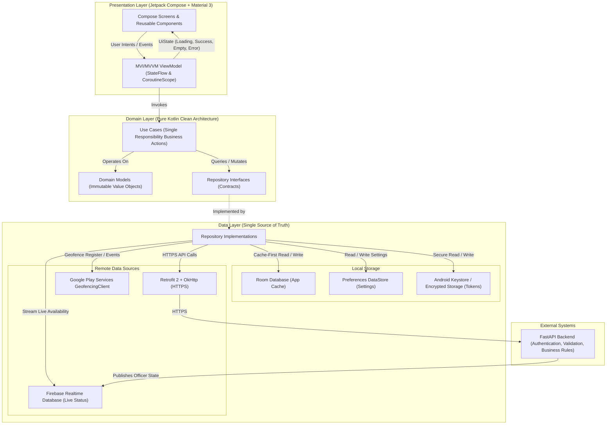
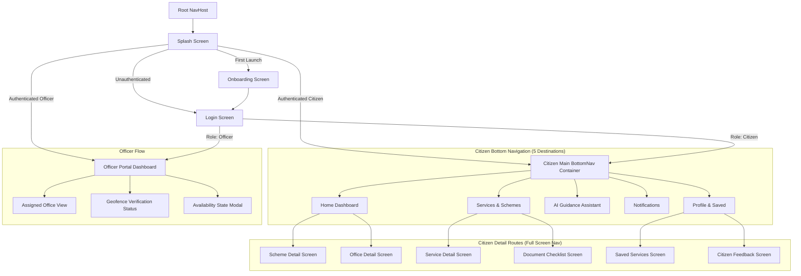
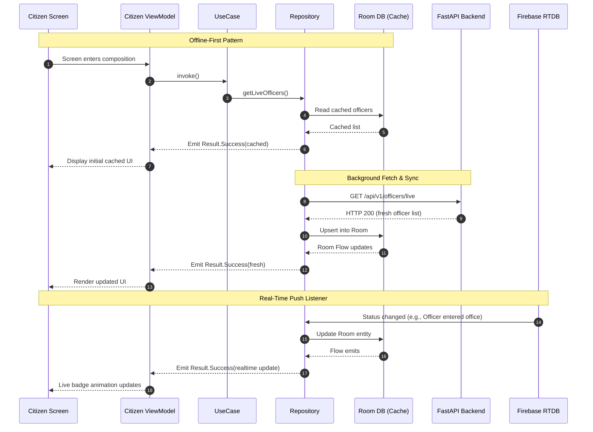

# TIME FOR PUBLIC — Android Architecture & Foundation Plan

This document establishes the senior architectural blueprint for **TIME FOR PUBLIC**, an AI-powered citizen guidance and government transparency native Android platform built exclusively with Kotlin, Jetpack Compose, Material 3, Clean Architecture, Hilt, Coroutines, StateFlow, Room, DataStore, and Google Play Services.

---

## 1. Final Android Package Structure

The project follows a feature-modular Clean Architecture layout strictly separating presentation, domain, and data tiers with unidirectional data flow:

```
com.timeforpublic
│
├── TimeForPublicApp.kt                # Application class with @HiltAndroidApp, notification channels
├── MainActivity.kt                    # Single activity host with @AndroidEntryPoint & AppNavGraph
│
├── core                               # Foundation infrastructure & cross-cutting utilities
│   ├── common                         # Result<T>, AppError, DispatchersProvider, Constants
│   ├── database                       # Room Database, TypeConverters, Migration schemes
│   ├── datastore                      # Preferences DataStore for non-secret settings & app state
│   ├── location                       # Play Services GeofencingClient wrapper, GeofenceBroadcastReceiver
│   ├── network                        # Retrofit, OkHttp, Kotlinx Serialization, AuthInterceptor, ErrorMapper
│   ├── notification                   # System NotificationManager, notification channel configurations
│   └── security                       # Android Keystore, EncryptedSharedPreferences/KeystoreTokenManager
│
├── domain                             # Pure business rules (zero framework/Android UI dependencies)
│   ├── model                          # Immutable domain models (User, OfficerStatus, GovernmentService, etc.)
│   ├── repository                     # Repository interface contracts (Single Source of Truth)
│   └── usecase                        # Single-responsibility business use cases
│       ├── auth                       # LoginUseCase, LogoutUseCase, GetCurrentUserUseCase
│       ├── citizen                    # GetServicesUseCase, SearchUseCase, GetSchemesUseCase, etc.
│       ├── documents                  # GetChecklistUseCase, VerifyDocumentEligibilityUseCase
│       ├── officer                    # UpdateAvailabilityUseCase, RegisterGeofenceUseCase
│       └── ai                         # QueryAiGuidanceUseCase
│
├── data                               # Data access implementations
│   ├── local                          # Room entities, Room DAOs, DataStore PreferencesDataSource
│   │   ├── dao                        # ServiceDao, SchemeDao, OfficeDao, SavedItemDao
│   │   └── entity                     # ServiceEntity, SchemeEntity, OfficeEntity, SavedItemEntity
│   ├── remote                         # Retrofit ApiService, DTOs, Serializers, Firebase Realtime Client
│   │   ├── dto                        # Request/Response DTOs mapping to/from domain models
│   │   └── firebase                   # Firebase RTDB officer availability live listener
│   └── repository                     # Repository implementations coordinating local cache + remote API
│
├── di                                 # Hilt dependency injection modules
│   ├── AppModule.kt                   # Dispatchers, Context, CoroutineScopes
│   ├── NetworkModule.kt               # Retrofit, OkHttpClient, AuthInterceptor, Serializer
│   ├── DatabaseModule.kt              # Room Database instance, DAO providers
│   ├── DataStoreModule.kt             # Preferences DataStore instance
│   ├── SecurityModule.kt              # Android Keystore SecureStorage, TokenManager
│   ├── LocationModule.kt              # Google Play Services GeofencingClient
│   ├── RepositoryModule.kt            # Binds repository interfaces to implementations
│   └── UseCaseModule.kt               # Provides domain use cases
│
├── ui                                 # Shared design system & theme
│   ├── components                     # Reusable M3 components (AppButton, StatusBadge, Cards, States)
│   └── theme                          # Color tokens, Typography, Shape, Elevation, Theme.kt
│
├── navigation                         # Application navigation architecture
│   ├── NavGraph.kt                    # NavHost graph, nested graphs, deep link definitions
│   ├── Routes.kt                      # Sealed/type-safe navigation routes and arguments
│   └── BottomNavItem.kt               # Bottom navigation destination specifications
│
└── feature                            # Feature UI layers (MVVM + Jetpack Compose)
    ├── splash                         # SplashScreen, SplashViewModel
    ├── onboarding                     # OnboardingScreen, OnboardingViewModel
    ├── auth                           # LoginScreen, AuthViewModel
    ├── home                           # Citizen HomeScreen, HomeViewModel (10 core dashboard sections)
    ├── services                       # ServicesScreen, ServiceDetailScreen, ServicesViewModel
    ├── schemes                        # SchemesScreen, SchemeDetailScreen, SchemesViewModel
    ├── documents                      # DocumentChecklistScreen, DocumentsViewModel
    ├── offices                        # OfficeDirectoryScreen, OfficeDetailScreen, OfficesViewModel
    ├── ai                             # AiAssistantScreen, AiAssistantViewModel
    ├── notifications                  # NotificationsScreen, NotificationsViewModel
    ├── saved                          # SavedServicesScreen, SavedServicesViewModel
    ├── profile                        # ProfileScreen, ProfileViewModel
    └── officer                        # OfficerDashboardScreen, OfficerViewModel
```

---

## 2. Architecture Diagram



---

## 3. Navigation Diagram



---

## 4. Dependency List

| Category | Dependency | Version | Purpose |
| :--- | :--- | :--- | :--- |
| **Language & Core** | `org.jetbrains.kotlin:kotlin-stdlib` | 2.0.21 | Native Kotlin runtime |
| | `androidx.core:core-ktx` | 1.15.0 | Android KTX extensions |
| | `androidx.lifecycle:lifecycle-runtime-ktx` | 2.8.7 | Lifecycle scopes |
| | `androidx.lifecycle:lifecycle-viewmodel-compose` | 2.8.7 | ViewModel in Compose |
| **UI & Compose** | `androidx.compose:compose-bom` | 2024.10.01 | Compose Bill of Materials |
| | `androidx.compose.ui:ui` | - | Core Compose UI |
| | `androidx.compose.material3:material3` | 1.3.1 | Material Design 3 components |
| | `androidx.compose.material:material-icons-extended`| - | Material 3 icons |
| | `androidx.navigation:navigation-compose` | 2.8.5 | Jetpack Compose Navigation |
| **DI** | `com.google.dagger:hilt-android` | 2.51.1 | Dependency Injection |
| | `com.google.dagger:hilt-compiler` (kapt/ksp) | 2.51.1 | Dagger Hilt code generator |
| | `androidx.hilt:hilt-navigation-compose` | 1.2.0 | Hilt ViewModel injection in Compose |
| **Concurrency** | `org.jetbrains.kotlinx:kotlinx-coroutines-android`| 1.9.0 | Asynchronous flow & coroutines |
| **Networking** | `com.squareup.retrofit2:retrofit` | 2.11.0 | Type-safe REST client |
| | `com.squareup.okhttp3:okhttp` | 4.12.0 | HTTP client |
| | `com.squareup.okhttp3:logging-interceptor` | 4.12.0 | Request/Response network logging |
| | `org.jetbrains.kotlinx:kotlinx-serialization-json` | 1.7.3 | High-performance JSON serializer |
| | `com.jakewharton.retrofit:retrofit2-kotlinx-serialization-converter` | 1.0.0 | Retrofit converter for kotlinx.serialization |
| **Local Storage** | `androidx.room:room-runtime` | 2.6.1 | Room SQLite ORM for app cache |
| | `androidx.room:room-ktx` | 2.6.1 | Room Coroutines/Flow extensions |
| | `androidx.room:room-compiler` (ksp) | 2.6.1 | Room annotation compiler |
| | `androidx.datastore:datastore-preferences` | 1.1.1 | Reactive key-value storage |
| **Security** | `androidx.security:security-crypto` | 1.1.0-alpha06 | Android Keystore backed MasterKey & EncryptedStorage |
| **Location & Geo** | `com.google.android.gms:play-services-location` | 21.3.0 | Google Play Services GeofencingClient & FusedLocationProvider |
| **Background** | `androidx.work:work-runtime-ktx` | 2.10.0 | Reliable background synchronization |
| **Testing** | `junit:junit` | 4.13.2 | Unit testing |
| | `org.jetbrains.kotlinx:kotlinx-coroutines-test` | 1.9.0 | Coroutine test dispatcher |
| | `io.mockk:mockk` | 1.13.12 | Mocking library |

---

## 5. Domain Model List

1. **`User`**:
   - `id: String`, `name: String`, `phone: String`, `role: UserRole (CITIZEN, OFFICER)`, `designation: String?`, `department: String?`, `officeId: String?`.
2. **`AvailabilityStatus`** *(Strictly adhering to mandated 7 states)*:
   - `IN_OFFICE`
   - `OUT_OF_OFFICE`
   - `IN_MEETING`
   - `FIELD_VISIT`
   - `TRAINING`
   - `ON_LEAVE`
   - `UNKNOWN`
3. **`OfficerStatus`**:
   - `officerId: String`, `name: String`, `designation: String`, `department: String`, `officeId: String`, `officeName: String`, `roomNumber: String`, `status: AvailabilityStatus`, `statusNote: String`, `lastUpdated: Long`, `isGeofenceVerified: Boolean`.
   - *(Zero queue count, zero appointment booking parameters).*
4. **`GovernmentService`**:
   - `id: String`, `title: String`, `category: ServiceCategory (SCHEME, SCHOLARSHIP, CERTIFICATE, WELFARE, GENERAL)`, `department: String`, `description: String`, `eligibilitySummary: String`, `requiredDocumentsSummary: List<String>`, `officialPortalUrl: String`, `estimatedProcessingDays: Int`.
5. **`GovernmentScheme`**:
   - `id: String`, `title: String`, `department: String`, `category: String`, `description: String`, `eligibilityCriteria: List<String>`, `benefits: String`, `requiredDocuments: List<String>`, `applicationUrl: String`, `isCentralGovt: Boolean`.
6. **`Scholarship`**:
   - `id: String`, `title: String`, `targetEducationLevel: String`, `awardAmount: String`, `deadline: String`, `eligibilityCriteria: List<String>`, `portalUrl: String`.
7. **`Certificate`**:
   - `id: String`, `title: String`, `issuingAuthority: String`, `feeInr: Int`, `validityPeriod: String`, `processingDays: Int`, `requiredDocuments: List<String>`, `portalUrl: String`.
8. **`GovernmentOffice`**:
   - `id: String`, `name: String`, `department: String`, `address: String`, `district: String`, `state: String`, `pinCode: String`, `latitude: Double`, `longitude: Double`, `geofenceRadiusMeters: Float = 200f`, `workingHours: String`, `contactPhone: String`.
9. **`DocumentItem` & `ServiceChecklist`**:
   - `id: String`, `name: String`, `issuingAuthority: String`, `isMandatory: Boolean`, `acceptedFormats: List<String>`, `validityPeriod: String`, `guidanceNotes: String`.
10. **`AiGuidanceResponse`**:
    - `id: String`, `query: String`, `answer: String`, `groundedSources: List<OfficialSourceMetadata>`, `timestamp: Long`.
11. **`OfficialSourceMetadata`**:
    - `title: String`, `department: String`, `gazetteRefOrUrl: String`.

---

## 6. Repository List

1. **`AuthRepository`**:
   - `login(phone, role): Result<User>`
   - `logout(): Result<Unit>`
   - `getCurrentUser(): Flow<User?>`
   - `getAuthToken(): String?`
2. **`ServiceRepository`**:
   - `getServices(category, query): Flow<Result<List<GovernmentService>>>`
   - `getServiceById(id): Flow<Result<GovernmentService>>`
3. **`SchemeRepository`**:
   - `getSchemes(filter): Flow<Result<List<GovernmentScheme>>>`
   - `getSchemeById(id): Flow<Result<GovernmentScheme>>`
4. **`OfficeRepository`**:
   - `getOffices(): Flow<Result<List<GovernmentOffice>>>`
   - `getOfficeById(id): Flow<Result<GovernmentOffice>>`
5. **`OfficerRepository`**:
   - `getLiveOfficers(): Flow<Result<List<OfficerStatus>>>`
   - `getOfficerById(id): Flow<Result<OfficerStatus>>`
   - `updateAvailability(officerId, status, note, isGeofenceVerified): Result<OfficerStatus>`
6. **`DocumentRepository`**:
   - `getServiceChecklists(): Flow<Result<List<ServiceChecklist>>>`
   - `getChecklistByServiceId(serviceId): Flow<Result<ServiceChecklist>>`
7. **`AiAssistantRepository`**:
   - `askQuestion(query, context): Result<AiGuidanceResponse>`
8. **`SavedServicesRepository`**:
   - `getSavedServices(): Flow<List<GovernmentService>>`
   - `toggleSaved(serviceId): Result<Boolean>`
9. **`UserPreferencesRepository`**:
   - `getThemePreference(): Flow<AppTheme>`
   - `setOnboardingCompleted(completed: Boolean): Unit`

---

## 7. Security Architecture

- **Untrusted Client Boundary**:
  - The Android app enforces client-side data validation but never assumes its execution environment is tamper-proof. All permissions, role authorizations, and transitions are validated server-side by the FastAPI backend.
- **Credential & Secret Protection**:
  - **Zero Embedded Secrets**: No LLM API keys, Firebase service credentials, database strings, or signing keys are embedded in APK.
  - **Android Keystore-backed Storage**: Sensitive auth tokens and cryptographic session keys are stored in `EncryptedSharedPreferences` using an AES-256-GCM MasterKey securely kept in the hardware-backed Android Keystore (`AndroidKeyStore`).
  - **Non-sensitive Storage**: App settings and filter preferences are isolated in Jetpack Preferences DataStore.
- **Network Security**:
  - Exclusively HTTPS (TLS 1.3/1.2).
  - `cleartextTrafficPermitted="false"` in `AndroidManifest.xml` via Network Security Configuration.
  - OkHttp `AuthInterceptor` automatically adds `Authorization: Bearer <token>` to protected endpoints and handles HTTP 401 tokens expiration gracefully.
- **R8 / ProGuard Protection**:
  - Full code obfuscation, dead code elimination, and data model serialization preservation for release builds.

---

## 8. Geofencing Architecture

- **Google Play Services GeofencingClient**:
  - Implements event-driven geofencing using Google Play Services location APIs.
  - Monitored perimeter: **200-meter radius** centered at the officer's assigned `GovernmentOffice`.
- **Event Dispatch Flow**:
  1. Officer logs in; `GeofenceManager` registers a `Geofence` (`GEOFENCE_TRANSITION_ENTER | GEOFENCE_TRANSITION_EXIT`) with expiration and responsiveness optimization.
  2. Transition event fires in Android system → triggers `PendingIntent` → invokes `GeofenceBroadcastReceiver`.
  3. `GeofenceBroadcastReceiver` validates the transition without reading continuous coordinates.
  4. Repository sends authenticated HTTPS event (`officeId`, `transitionType`, `timestamp`) to FastAPI.
  5. FastAPI validates event freshness and permissions, updates officer availability in PostgreSQL, and syncs status to Firebase Realtime Database.
  6. Citizen app receives updated status via Firebase Realtime Database.
- **Strict Privacy Compliance**:
  - **No continuous GPS polling**: Geofence is 100% event-driven.
  - **No coordinate logging or transmission**: Officer coordinates are never uploaded to the backend or exposed to citizens.
  - Citizens see only high-level availability states (e.g. `IN_OFFICE` or `FIELD_VISIT`).

---

## 9. Data Flow Architecture



---

## 10. Development Phases

### Phase 1: Android Foundation (Current Implementation Scope)
- **1.1 Build Configuration & Dependency Setup**:
  - Add KSP plugin, Dagger-Hilt plugin, and Kotlinx Serialization plugin.
  - Add Jetpack Room (2.6.1), Preferences DataStore (1.1.1), Security-Crypto (1.1.0-alpha06), Play Services Location (21.3.0), WorkManager, and Serialization dependencies.
- **1.2 Core Infrastructure**:
  - Initialize `TimeForPublicApp` with `@HiltAndroidApp` and system notification channels.
  - Create `MainActivity` with `@AndroidEntryPoint`, edge-to-edge Compose layout, and NavHost.
  - Build `DispatchersProvider`, unified `Result<T>` and `AppError` models.
  - Setup Android Keystore backed `SecureStorage` (migrating away from plaintext SharedPreferences).
  - Setup Jetpack Preferences DataStore manager.
  - Setup OkHttp network client, `AuthInterceptor`, and Kotlinx Serialization converters.
  - Setup Room database (`AppDatabase`) and base DAOs.
- **1.3 Domain Models & Contracts**:
  - Standardize `AvailabilityStatus` to the strict 7 states: `IN_OFFICE`, `OUT_OF_OFFICE`, `IN_MEETING`, `FIELD_VISIT`, `TRAINING`, `ON_LEAVE`, `UNKNOWN`.
  - Strip out appointment booking and queue counters.
  - Define domain repository interfaces for Auth, Services, Schemes, Offices, Officers, Documents, AI.
  - Create Use Case layer classes for core queries.
- **1.4 Design System & UI Foundation**:
  - Material 3 theme palette, typography, shapes.
  - Reusable components: `AppButton`, `AppTextField`, `StatusBadge`, `LoadingView`, `EmptyState`, `ErrorState`, `RetryButton`, `ServiceCard`, `SchemeCard`, `OfficeCard`, `NotificationCard`, `DocumentChecklistCard`.
- **1.5 Dependency Injection (Hilt)**:
  - Modules: `AppModule`, `NetworkModule`, `DatabaseModule`, `DataStoreModule`, `SecurityModule`, `LocationModule`, `RepositoryModule`.
- **1.6 Verification**:
  - Verify build compilation (`./gradlew assembleDebug`), unit tests (`./gradlew test`), and lint checks.

### Phase 2: Authentication & Onboarding
- Splash screen session routing, phone OTP login flow, role-based navigation (Citizen vs Officer).

### Phase 3: Citizen Dashboard & Services Discovery
- 10-section Citizen Home Dashboard, Services catalog, Government Schemes, Scholarships, Certificates, Welfare programs, search & filtering.

### Phase 4: Document Checklist & AI Assistant
- Interactive document checklists with offline caching, AI citizen helpdesk screen communicating with FastAPI RAG backend with grounded citations.

### Phase 5: Officer Flow & Geofencing System
- Role-based Officer Dashboard, Google Play Services `GeofencingClient` registration with 200m office perimeter, `GeofenceBroadcastReceiver`, privacy-preserving availability state machine.

### Phase 6: Realtime Availability, Notifications & End-to-End Verification
- Firebase Realtime Database live streaming, Firebase Cloud Messaging integration, full testing, ProGuard/R8 verification, and release preparation.

---

## User Review Required

> [!IMPORTANT]
> - **Zero Appointment/Queue Policy**: In strict accordance with the product scope, all previous references to `activeQueueCount` or queue booking in domain models will be removed.
> - **Officer Availability States**: Only the 7 mandated states (`IN_OFFICE`, `OUT_OF_OFFICE`, `IN_MEETING`, `FIELD_VISIT`, `TRAINING`, `ON_LEAVE`, `UNKNOWN`) will be supported.
> - **Dependency Upgrades**: In Phase 1 we will add Dagger-Hilt, Room, DataStore, and Security Crypto to `build.gradle.kts` to satisfy the enterprise architectural requirements.
